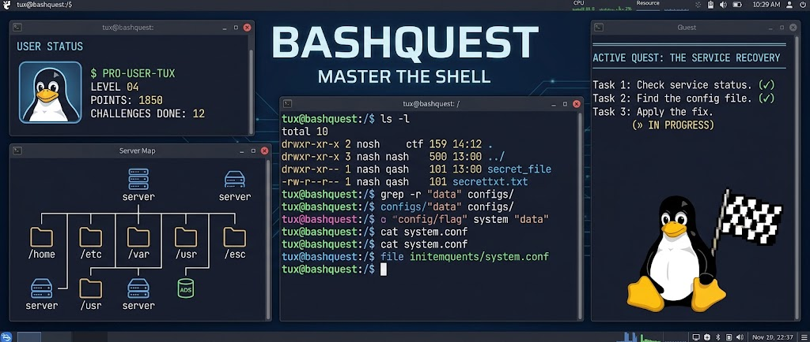

# BashQuest 🐧

[](https://www.gnu.org/licenses/gpl-3.0)
[](https://github.com/hardlygospel/bashquest)
[](https://github.com/hardlygospel/bashquest)
[](https://hardlygospel.github.io/bashquest/levels/)
[](https://hardlygospel.github.io/bashquest/)

**An interactive terminal game that turns your shell into a full systems administration training ground.** No slides, no video, no sandboxed browser IDE: you type real commands, against a real (simulated) filesystem, and a mentor character reacts to every answer. 61 levels, 12 tiers, zero dependencies.

📖 **Full docs:** [hardlygospel.github.io/bashquest](https://hardlygospel.github.io/bashquest/)

---

## Contents

- [What is BashQuest?](#what-is-bashquest)
- [What you'll learn](#what-youll-learn)
- [Meet Tasmania](#meet-tasmania)
- [Features](#features)
- [Achievements & graduation](#achievements--graduation)
- [Quick start](#quick-start)
- [How it works](#how-it-works)
- [Full level list](#full-level-list)
- [Requirements](#requirements)
- [Documentation](#documentation)
- [License](#license)

---

## What is BashQuest?

BashQuest is a single Bash script (`bashquest.sh`, no build step, no installer) that:

- Creates a **pseudo-login system**: register an account, log in, and your progress is saved per user
- Drops you into 61 **progressive levels** across 12 tiers, from `ls` and `pwd` on day one to building a kernel and ricing a tiling window manager by the end
- Runs every challenge against a **real simulated environment**: actual files, actual log files, actual directory trees created in a temp sandbox, so the commands you type do something, not just get string-matched against a static answer
- Validates your answer with **pattern matching**, not exact-string matching, so `ls -la` and `ls -al` are both accepted where either is correct
- Explains **why** a command exists and when a real sysadmin reaches for it, not just what to type
- Never touches your real filesystem, your real users, or your real network. Everything happens in a disposable sandbox under `/tmp`

It's built for one goal: walk out the other side able to comfortably administrate a corporate network, **and** set up a genuinely great-looking home Linux desktop.

---

## What you'll learn

Twelve tiers, building on each other, from absolute basics to topics most "Linux 101" courses never touch:

**Tier 1: Beginner** (levels 1-4)
- Navigation: `ls`, `cd`, `pwd`, `mkdir`, `rmdir`
- File operations: `cat`, `touch`, `cp`, `mv`, `rm`, `tar`
- Text & search: `grep`, `find`, `wc`, `sort`, `uniq`
- Permissions: `chmod`, `chown`, `whoami`, `id`

**Tier 2: Intermediate** (levels 5-8)
- Process management: `ps`, `kill`, `jobs`, `bg`, `fg`
- Text processing: `awk`, `sed`, `cut`, `tr`, `head`, `tail`
- Networking basics: `curl`, `wget`, `ping`, `ssh`, `ss`
- Shell scripting: variables, loops, conditionals, functions

**Tier 3: Pipes & Patterns** (levels 9-14)
- Advanced piping and command chaining, `tee`
- I/O redirection: `>`, `>>`, `<`, `2>`, `2>&1`, `/dev/null`
- Regular expressions, from anchors to alternation
- Advanced `grep`, `sed`, and `awk`

**Tier 4: Power Tools** (levels 15-20)
- `xargs` and `find -exec`
- Disk and storage inspection
- System information gathering
- User management, SSH key auth, environment and shell config

**Tier 5: Expert** (levels 21-28)
- Cron scheduling
- Log investigation and live monitoring
- Package management across distros
- Deep compression, string processing, arrays, error handling
- systemd services and units

**Tier 6: Storage & Filesystems** (levels 29-34)
- Reading partition tables with `fdisk` and `parted`
- Partitioning disks and formatting filesystems
- Mounting and `/etc/fstab`
- Full LVM lifecycle: physical volumes, volume groups, logical volumes, resizing, and snapshots

**Tier 7: File Editing & Sharing** (levels 35-39)
- Vim essentials: modal editing, search, substitution
- Access Control Lists (ACLs) beyond basic chmod
- Samba file sharing for Windows clients
- NFS sharing for Unix/Linux clients
- Backup and sync with `rsync`

**Tier 8: Networking** (levels 40-45)
- IP addressing and interface management
- Routing tables and gateways
- DNS tools: `dig`, `nslookup`, resolver config
- Firewalls: `iptables`, `nftables`, `ufw`
- VLANs and 802.1Q trunking
- Bonding, packet capture, and troubleshooting

**Tier 9: Storage Networking & SAN** (levels 46-49)
- iSCSI initiators and targets
- NFS/SMB at scale with `autofs`
- Multipathing and SAN concepts, WWNs, zoning
- Fibre Channel and storage-layer troubleshooting

**Tier 10: Boot Process & Kernel** (levels 50-54)
- The full boot timeline, from firmware to userspace
- GRUB2 configuration and recovery
- Alternative boot managers: systemd-boot, rEFInd
- Diagnosing and recovering from kernel panics
- Building a kernel from source

**Tier 11: Media Management** (levels 55-57)
- `ffmpeg` transcoding, audio extraction, thumbnails
- Organizing a large media library, integrity checking
- Home media server fundamentals (hardware transcode, layout)

**Tier 12: Desktop Ricing** (levels 58-61, the finale)
- X11 vs Wayland, window manager fundamentals
- The i3 tiling window manager
- AwesomeWM and compositors (picom)
- Dotfiles management and theming

See the [full level list](#full-level-list) below for every level by name, or the [levels documentation](https://hardlygospel.github.io/bashquest/levels/) for the complete breakdown with examples.

---

## Meet Tasmania

Every screen in BashQuest is narrated by **Tasmania**, a mentor character (the in-game handle of [Tony "Hardlygospel" Hosaroygard](https://github.com/hardlygospel), who built this thing). Tasmania:

- Reacts to every correct answer, every wrong one, and every hint you take
- Calls out streaks at 3, 5, and 8 correct answers in a row
- Opens with an origin story when you create an account
- Delivers a full closing speech at graduation

It's flavor, not a mechanic: nothing Tasmania says changes your score. But it's there on every single screen, from your first login to the certificate at the end.

---

## Features

**Gameplay**
- 61 levels, 5-8 challenges each, 359 challenges total
- 3 lives per session, lose one on a wrong answer or a skip
- XP earned per correct answer, scaled to challenge difficulty
- `hint` shows a detailed clue for the current challenge, free of cost
- `skip` passes a challenge for 1 life

**Progression**
- Pseudo-login: register/login with hashed passwords, saved per user under `~/.bashquest/`
- Levels unlock sequentially: clear level N to unlock N+1
- **Topic jump menu**: pick a tier, then a level within it, instead of scrolling one long list
- Tier milestone screens at the end of each of the 12 tiers
- Leaderboard ranking every player account on the machine by total XP

**Presentation**
- Full ANSI-colour TUI: banners, boxed challenges, a live status bar
- A fake boot sequence on launch
- In-game command reference covering all 61 level topics
- Streak tracking and a 6-badge achievement system (Purist, No Shortcuts, Untouchable, On a Roll, Unstoppable, Graduate)

**Technical**
- Single self-contained Bash script, no external dependencies
- Targets bash 3.2+ for macOS compatibility out of the box
- Runs entirely in a disposable sandbox, never touches real files, users, or network config
- Works identically on Linux and macOS

---

## Achievements & graduation

Six badges to earn, viewable any time from the main menu:

| Badge | Earned by |
|---|---|
| **Purist** | Never using a hint |
| **No Shortcuts** | Never using skip |
| **Untouchable** | Never losing a life |
| **On a Roll** | A 5-answer streak |
| **Unstoppable** | A 10-answer streak |
| **Graduate** | Completing all 61 levels |

Clear all 61 levels and you get a full graduation ceremony:
- A certificate with your name, final XP, best streak, and badge count
- The certificate is written to disk at `~/.bashquest/<your-name>.certificate.txt`, yours to keep
- A closing speech from Tasmania

---

## Quick start

```bash
# Download
curl -o bashquest.sh https://raw.githubusercontent.com/hardlygospel/bashquest/main/bashquest.sh

# Make executable
chmod +x bashquest.sh

# Run
bash bashquest.sh
```

No dependencies. No installation. Pure Bash.

---

## How it works

1. **Register** a username and password (minimum 4 characters), or log in if you already have one
2. From the **main menu**, continue your current level, jump to any unlocked topic, check the leaderboard, or view achievements
3. Each **challenge** describes a task in plain English, then drops you at a fake terminal prompt
4. Type the command. It's checked against a pattern, so equivalent valid answers are accepted, not just one exact string
5. Correct answers earn XP and may trigger a streak callout. Wrong answers cost a life. `hint` and `skip` are always available mid-challenge
6. Finish the last level of a tier and get a milestone screen instead of the usual level-complete screen
7. Finish level 61 and graduate, certificate included

---

## Full level list

| # | Level | Commands |
|---|---|---|
| 1 | Navigation & Basics | `ls` `cd` `pwd` `mkdir` `rmdir` |
| 2 | File Operations | `cat` `touch` `cp` `mv` `rm` `tar` |
| 3 | Text & Search | `grep` `find` `wc` `sort` `uniq` |
| 4 | Permissions | `chmod` `chown` `whoami` `id` |
| 5 | Processes | `ps` `kill` `jobs` `bg` `fg` |
| 6 | Text Processing | `awk` `sed` `cut` `tr` `head` `tail` |
| 7 | Networking | `curl` `wget` `ping` `ssh` `ss` |
| 8 | Shell Scripting | variables, loops, if/else, functions |
| 9 | Advanced Piping | `\|` chains, `tee`, `sort\|uniq -c` |
| 10 | I/O Redirection | `>` `>>` `<` `2>` `2>&1` `/dev/null` |
| 11 | Regular Expressions | `^` `$` `.` `*` `+` `?` `[]` `\|` |
| 12 | Advanced grep | `-n` `-l` `-c` `-A/B/C` `-o` `--include` |
| 13 | Advanced sed | `s///g` `-i` address ranges, `/d` |
| 14 | Advanced awk | `NR` `NF` `BEGIN` `END` `printf` |
| 15 | xargs & find | `-exec` `xargs -I{}` `-size` `-mtime` |
| 16 | Disk & Storage | `df` `du` `lsblk` `findmnt` |
| 17 | System Info | `uname` `lscpu` `free` `uptime` `lsof` |
| 18 | User Management | `useradd` `usermod -aG` `passwd` `su` |
| 19 | SSH & Keys | `ssh-keygen` `ssh-copy-id` `-i` `-L` |
| 20 | Environment | `PATH` `export` `alias` `source` `PS1` |
| 21 | Cron & Scheduling | `crontab` syntax, `at` |
| 22 | Logs & Monitoring | `tail -f` `journalctl` `logger` |
| 23 | Package Management | `apt` `dnf` `brew` |
| 24 | Compression | `gzip` `bzip2` `xz` `zip` `zcat` |
| 25 | String Processing | `${#v}` `${v:0:n}` `${v//f/r}` `printf` |
| 26 | Arrays | indexed arrays, loops, associative |
| 27 | Functions & Errors | `set -euo pipefail` `trap` `$?` |
| 28 | Systemd | `systemctl` `journalctl -fu` unit files |
| 29 | Disks & Partitions | `lsblk` `fdisk -l` `parted -l` `blkid` |
| 30 | Partitioning | `parted mkpart` `fdisk n/w` `partprobe` |
| 31 | Filesystems | `mkfs.ext4` `mkfs.xfs` `mkswap` |
| 32 | Mounting & fstab | `mount` `umount` `/etc/fstab` UUID |
| 33 | LVM: Volumes & Groups | `pvcreate` `vgcreate` `lvcreate` |
| 34 | LVM: Resize & Snapshots | `lvextend` `resize2fs` `lvcreate -s` |
| 35 | Vim Essentials | `i` `Esc` `:wq` `dd` `/search` `:%s` |
| 36 | Permissions & ACLs | `setfacl` `getfacl` `umask` |
| 37 | Samba File Sharing | `smb.conf` `smbpasswd` `testparm` |
| 38 | NFS Sharing | `/etc/exports` `exportfs` `showmount` |
| 39 | Sync & Backup | `rsync -avz` `--delete` `-e ssh` |
| 40 | IP Addressing | `ip addr` `ip link` `hostname -I` |
| 41 | Routing & Gateways | `ip route` `traceroute` `mtr` |
| 42 | DNS Tools | `dig` `nslookup` `/etc/hosts` |
| 43 | Firewalls | `iptables` `nft` `ufw` |
| 44 | VLANs & Trunking | `ip link ... type vlan` `802.1Q` |
| 45 | Bonding & Troubleshooting | `tcpdump` `mtr` `ip -s link` |
| 46 | iSCSI Initiators & Targets | `iscsiadm` `targetcli` |
| 47 | NFS/SMB at Scale | `autofs` `automount` |
| 48 | Multipath & SAN | `multipath -ll` WWN, zoning |
| 49 | Fibre Channel Storage | `lsscsi` `systool` `multipath -F` |
| 50 | Boot Process Overview | `systemctl get-default` `systemd-analyze` |
| 51 | GRUB2 | `update-grub` `grub-mkconfig` |
| 52 | Alternative Boot Managers | `bootctl` `systemd-boot` `rEFInd` |
| 53 | Kernel Panics & Recovery | rescue mode, `journalctl -b -1`, initramfs |
| 54 | Building a Kernel | `menuconfig` `make` `modules_install` |
| 55 | ffmpeg Basics | transcode, extract audio, thumbnails |
| 56 | Media Library Organization | `find` `rename` `sha256sum` |
| 57 | Home Media Server | layout, hwaccel, transcode |
| 58 | X11/Wayland & WMs | `XDG_SESSION_TYPE` `loginctl` |
| 59 | i3 Window Manager | `mod+enter` workspaces, config |
| 60 | AwesomeWM & Compositors | `rc.lua` `picom` |
| 61 | Dotfiles & Theming | `stow` `git` bare-repo dotfiles |

---

## Requirements

- Bash 3.2 or newer (the macOS default, no upgrade needed)
- A terminal that supports ANSI colour and emoji
- Nothing else. No `sudo`, no packages to install, no config to write

---

## Documentation

The full docs site has more detail than fits in this README:

- [Getting started](https://hardlygospel.github.io/bashquest/getting-started/): installation and how to play
- [Levels](https://hardlygospel.github.io/bashquest/levels/): every level, every tier, with command tables and examples
- [Command reference](https://hardlygospel.github.io/bashquest/reference/): quick lookup for every command covered

---

## License

Licensed under [GPL-3.0](https://www.gnu.org/licenses/gpl-3.0).

Copyright © 2026 Tony "Hardlygospel" Hosaroygard. Built by [github.com/hardlygospel](https://github.com/hardlygospel).
